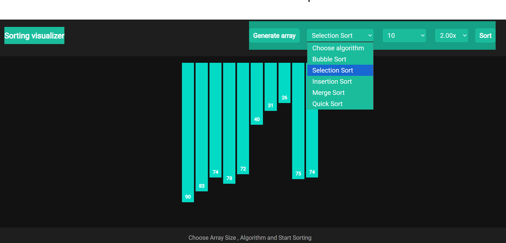

# 📊 Sorting Visualizer

An interactive web application that visualizes how various sorting algorithms work using animated bars. Built using **HTML**, **CSS**, and **JavaScript**, this tool helps users understand the logic and behavior of different sorting techniques in a visual and engaging way.

---
## Phase 1

## Phase 2

## Phase 3

## 🚀 Features

- 🎯 Visualize sorting algorithms step-by-step
- 🎨 Dynamic color changes for comparisons, swaps, and sorted elements
- 🔄 Random array generation
- 🖱️ Easy-to-use interface with buttons for each algorithm
- ⚡ Smooth animations using async/await and DOM manipulation

---

## 🔧 Tech Stack

| Technology   | Description                        |
|--------------|------------------------------------|
| HTML         | Structure of the visualizer        |
| CSS          | Styling and animation of bars      |
| JavaScript   | Sorting logic, UI interactions     |

---

## 📌 Implemented Algorithms

- ✅ **Bubble Sort**
- ✅ **Selection Sort**
- ✅ **Insertion Sort**
- ✅ **Quick Sort**
- ✅ **Merge Sort**

---
## 🧠 How It Works

- Bars are represented as `
` elements with dynamic heights.
- When a sorting algorithm is selected:
  - Bars are highlighted using colors:  
    - 🔴 Red and Yelow: comparing  
    - 🟢 Dark Green: sorted  
    - 🟦 Turquoise: default
  - Swaps are animated using height exchanges with `setTimeout()` and `async/await`.

